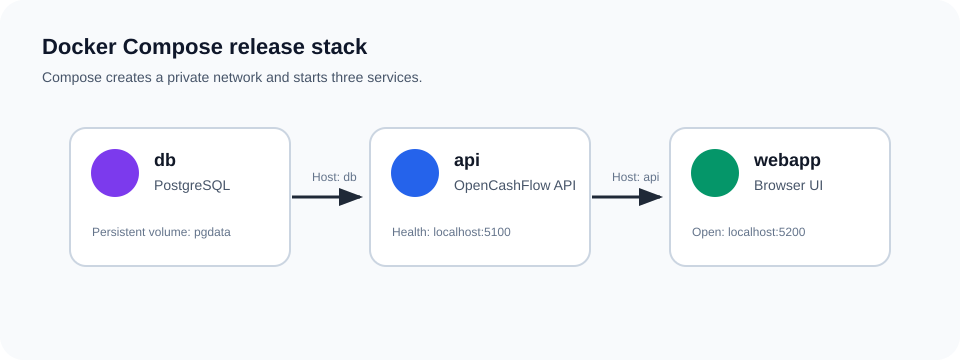
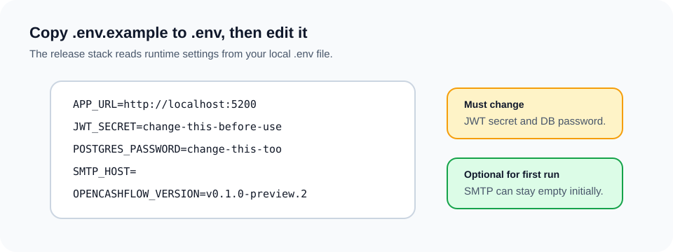
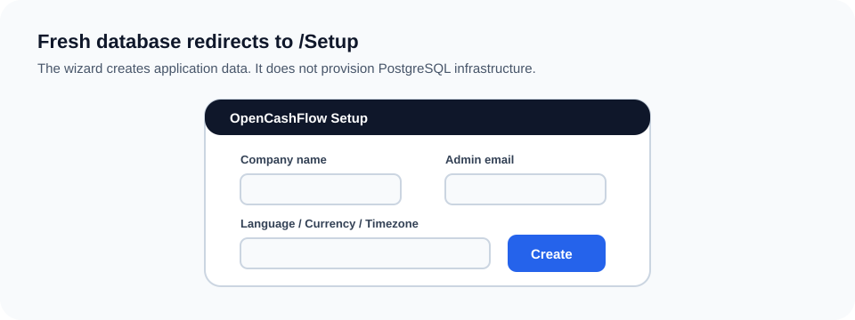
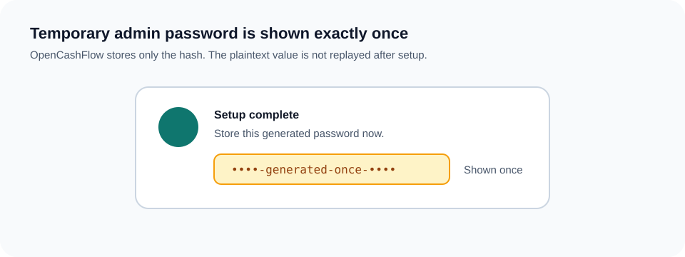

# Docker Compose Visual Guide

This visual guide explains the OpenCashFlow preview release package for first-time Docker Compose users.

OpenCashFlow is shipped as a three-service stack:

- `db`: PostgreSQL database.
- `api`: OpenCashFlow API.
- `webapp`: browser-facing WebApp.

The release package is for evaluation and early self-hosted testing. It is not a production-ready deployment profile.

## 1. Understand The Stack



Docker Compose creates a private network for the containers.

- `api` connects to PostgreSQL using the internal hostname `db`.
- `webapp` connects to the API using the internal hostname `api`.
- You open the WebApp from your browser at `http://localhost:5200`.
- The API health endpoint is available at `http://localhost:5100/health`.

## 2. Download The Preview Package

```bash
curl -LO https://github.com/Reckonry/OpenCashFlow/releases/download/v0.1.0-preview.2/OpenCashFlow-0.1.0-preview.2.tar.gz
# or:
# wget https://github.com/Reckonry/OpenCashFlow/releases/download/v0.1.0-preview.2/OpenCashFlow-0.1.0-preview.2.tar.gz
tar -xzf OpenCashFlow-0.1.0-preview.2.tar.gz
cd OpenCashFlow-0.1.0-preview.2
```

## 3. Configure `.env`



Create a local environment file:

```bash
cp .env.example .env
```

Edit `.env` before shared use.

At minimum, change:

- `JWT_SECRET`
- `POSTGRES_PASSWORD`
- `APP_URL`, if users will open a URL other than `http://localhost:5200`

SMTP can remain empty for the first local setup.

## 4. Start The Stack

```bash
docker compose -f docker-compose.release.yml up -d
```

Check status:

```bash
docker compose -f docker-compose.release.yml ps
curl -fsS http://localhost:5100/health
```

## 5. Complete First-Run Setup



Open:

```text
http://localhost:5200
```

On a fresh database, the WebApp redirects to `/Setup`.

Enter:

- company name;
- administrator first and last name;
- administrator email;
- language;
- currency;
- country;
- timezone.

The setup wizard creates application data only. It does not provision PostgreSQL users, databases, permissions, TLS, or infrastructure.

## 6. Store The Temporary Password



After setup completes, OpenCashFlow shows a generated temporary administrator password exactly once.

Store it immediately. It is not shown again.

Do not paste this password into issues, screenshots, logs, or support channels.

## 7. First Login And Password Change


Log in with:

- administrator email;
- generated temporary password.

OpenCashFlow requires a password change before normal use.

## 8. Stop, Update, And Back Up

Stop without deleting data:

```bash
docker compose -f docker-compose.release.yml down
```

Update to a newer preview:

```bash
docker compose -f docker-compose.release.yml pull
docker compose -f docker-compose.release.yml up -d
```

Back up PostgreSQL before updates:

```bash
docker compose -f docker-compose.release.yml exec db \
  pg_dump -U "${POSTGRES_USER:-postgres}" \
  -d "${POSTGRES_DB:-opencashflow}" \
  -Fc \
  -f /tmp/opencashflow.backup

docker compose -f docker-compose.release.yml cp \
  db:/tmp/opencashflow.backup ./opencashflow.backup
```

Read the full install guide for more detail:

```text
Docs/setup/docker-compose-release-install.md
```
