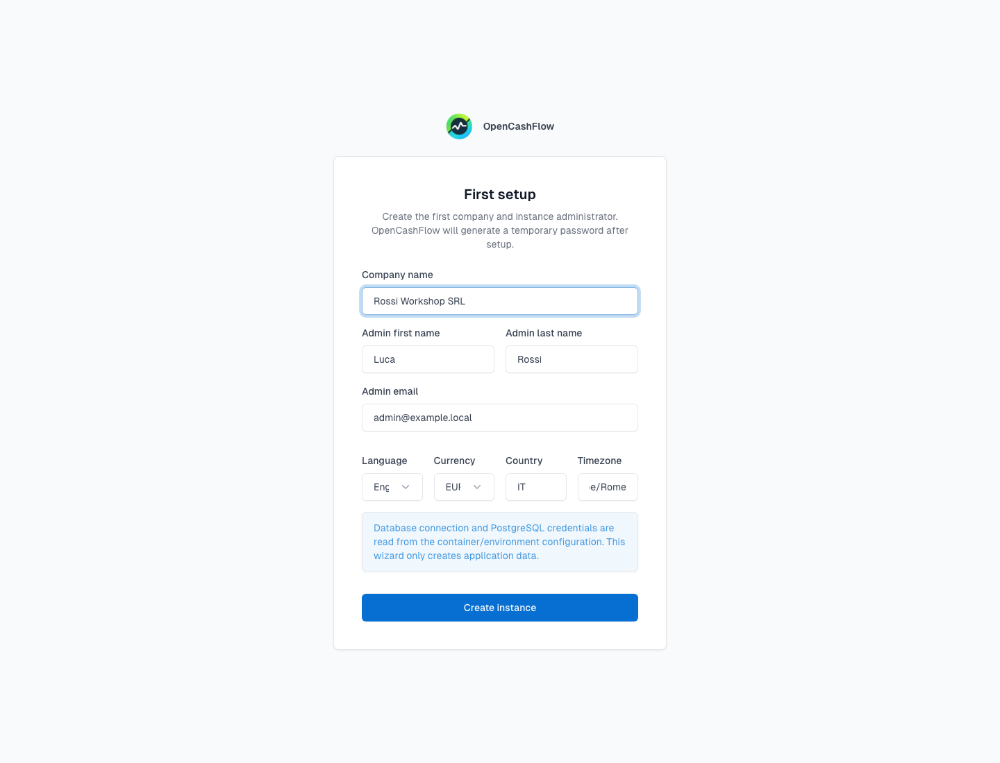
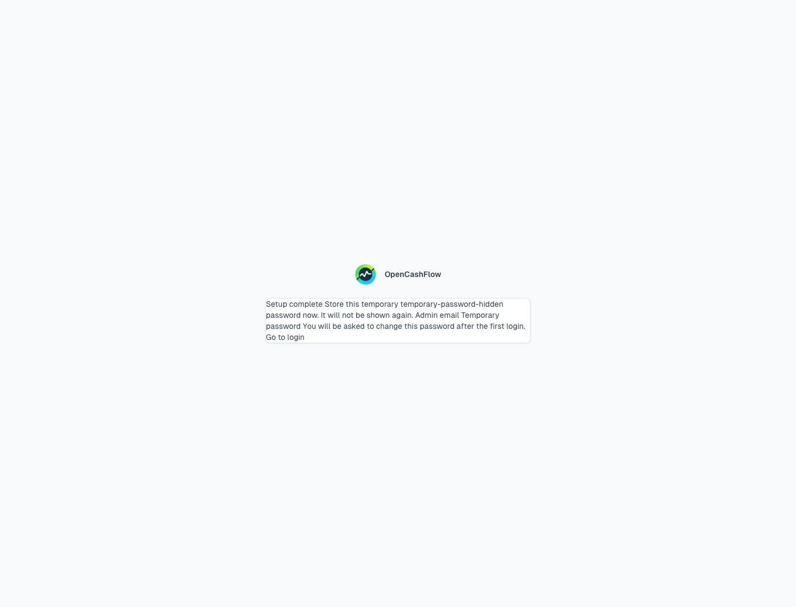
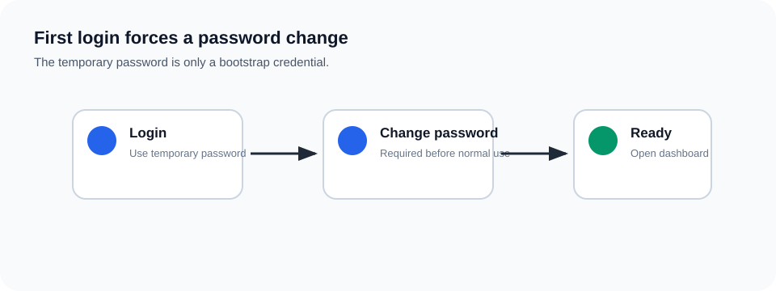
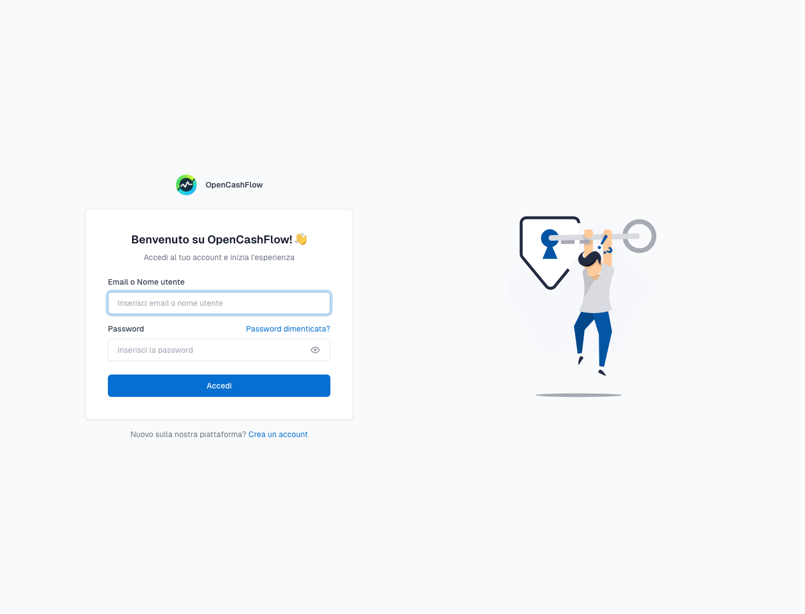

# Docker Compose Install

OpenCashFlow preview releases run as a Docker Compose stack with three services:


- `db`: PostgreSQL database.
- `api`: OpenCashFlow API.
- `webapp`: browser-facing WebApp.

The containers are separate on purpose. Docker Compose creates the private network and connects `webapp -> api -> db`.

## Minimal Install

```bash
curl -LO https://github.com/Reckonry/OpenCashFlow/releases/download/v0.1.0-preview.2/OpenCashFlow-0.1.0-preview.2.tar.gz
tar -xzf OpenCashFlow-0.1.0-preview.2.tar.gz
cd OpenCashFlow-0.1.0-preview.2
cp .env.example .env
```

Edit `.env` before shared use:


At minimum, change:

- `JWT_SECRET`
- `POSTGRES_PASSWORD`
- `APP_URL`, if users will open a URL other than `http://localhost:5200`

Then start the stack:

```bash
docker compose -f docker-compose.release.yml up -d
```

Open:

```text
http://localhost:5200
```

## First-Run Setup

On a fresh database, the WebApp redirects to `/Setup`.


The setup wizard asks for:

- company name;
- administrator first and last name;
- administrator email;
- language;
- currency;
- country;
- timezone.

The setup wizard creates application data only. It does not create PostgreSQL users, databases, TLS certificates, or infrastructure permissions.

Real screenshot captured from the Docker Compose smoke stack:



## Temporary Password

After setup completes, OpenCashFlow shows a generated temporary administrator password exactly once.


Store it immediately. It is not shown again.

The real screenshot below is masked before publishing so no generated secret is stored in the Wiki:



## First Login

Log in with the administrator email and the generated temporary password.



OpenCashFlow requires a password change before normal use.

After setup is complete, `/Setup` is locked and redirects back to login:



## Stop And Update

Stop without deleting data:

```bash
docker compose -f docker-compose.release.yml down
```

Update to a newer preview:

```bash
docker compose -f docker-compose.release.yml pull
docker compose -f docker-compose.release.yml up -d
```

Back up the PostgreSQL volume before updates. The release package includes more detail in:

```text
Docs/setup/docker-compose-release-install.md
```
