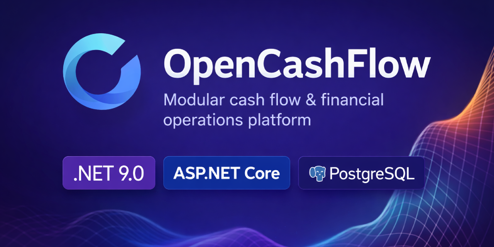

# 💰 OpenCashFlow


**OpenCashFlow** is an open-source, self-hosted platform for managing, tracking, and analyzing cash flows and receipts.
It is designed to be installed by a company on its own server, with full transparency over incoming and outgoing payments,
strong auditability, advanced filtering, and access control.

OpenCashFlow can support multi-company scenarios for consultants, accounting studios, groups, or shared internal instances.
That model is not a mandatory SaaS monetization layer. Managed hosting, setup, support, or consulting can be offered as
external services, but they are not required to run the software.

---

## ⚖️ License (Important)

This project is licensed under the **GNU Affero General Public License v3.0 (AGPL-3.0)**.

> **If you run OpenCashFlow as a network service (SaaS), you must provide the complete corresponding source code
> to the users of that service, in compliance with the AGPL.**

See the `LICENSE` file for full details.

---

## 🚀 Key Features

- 📋 **Payment registration** (income / expense)
- 🧾 Classification by:
  - Payment method (Cash, Card, Bank Transfer, etc.)
  - Document type (Invoice, Receipt, etc.)
  - Description and reason
- 🔐 **User management & auditing**
  - Created / edited / deleted tracking
  - Soft delete support
- 🔎 **Advanced filtering system**
  - Date ranges (`FromDate` / `ToDate`)
  - Amount ranges (`MinAmount` / `MaxAmount`)
  - Payment method, transaction type, operator
- 📦 **RESTful API**
  - Pagination
  - Dynamic sorting (`SortBy`)
  - Secure DTO-based queries (`Payment_Filter_DTO`)
- 🖥️ **Responsive Web UI**
  - Bootstrap modals
  - Real-time updates via SignalR
- 📊 Ready for export, dashboards, and forecasting

---

## 🏗️ Architecture

- **Backend:** ASP.NET Core + Entity Framework Core
- **Frontend:** Bootstrap 5 + AJAX + jQuery
- **Database:** PostgreSQL
- **Logging:** Serilog with Slack notifier and retry strategy
- **Security:** JWT authentication + ACL (multi-company ready)
- **Runtime components:** API, Web App, Contracts, Application, Domain, Infrastructure, tests

---

## 🧰 Quick Setup

### Requirements

- .NET 9 SDK
- PostgreSQL 16+ for local/manual runs
- Docker and Docker Compose for containerized runs
- Visual Studio, Rider, or VS Code

### Restore, build, and test

```bash
git clone https://github.com/<your-username>/OpenCashFlow.git
cd OpenCashFlow

dotnet restore OpenCashFlow.sln
dotnet build OpenCashFlow.sln --configuration Release --no-restore
dotnet test OpenCashFlow.sln --configuration Release --no-build
```

### Run with Docker Compose

```bash
cp .env.example .env
docker compose up --build
```

Local URLs:

- Web app: `http://localhost:5200`
- API: `http://localhost:5100`
- PostgreSQL: `localhost:5432`

Development compose file:

```bash
docker compose -f docker-compose.dev.yml up --build
```

Development URLs:

- Web app: `http://localhost:5200`
- API: `http://localhost:5100`

### Self-hosted defaults

Standard installations do not require Stripe, SaaS plans, active subscriptions, a separate Admin application, or a real
SMTP provider to start the core application. Historical Billing/Stripe schema artifacts may still exist for migration
compatibility, but they are not part of the core runtime.

For manual local runs, configure `DEFAULT_CONN_STRING` or `ConnectionStrings:DefaultConnectionString` and then run the project you need:

```bash
dotnet run --project src/OpenCashFlow.API/OpenCashFlow.API.csproj
dotnet run --project src/OpenCashFlow.WebApp/OpenCashFlow.WebApp.csproj
```

Detailed installation, migration, backup, and reverse proxy notes are in
[Docs/installation.md](Docs/installation.md).
